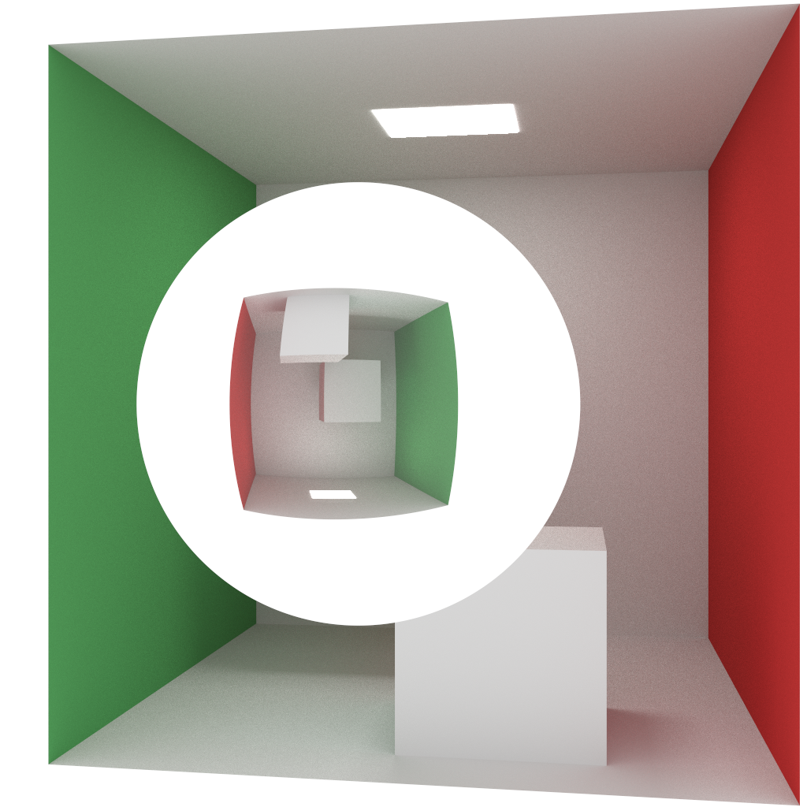
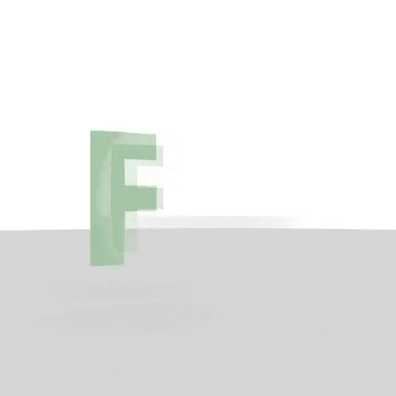

# Raytracer written in C++

I used this wonderful article to build the actual raytracer, before modifying it [https://raytracing.github.io/books/RayTracingTheNextWeek.html](https://raytracing.github.io/).



Then I added a new type of object, a lens.

## Raytracing lenses

The question I wanted to answer was: can lenses look realistic in a world where light rays don't travel from source to the eye, but from the eye to the source?

To create the actual lens, I had to implement two things:
 - check if the ray hit the lens
 - calculate the normal to the surface of the lens (which direction the ray will reflect/refract)


## Check for hit

To check if a ray hits the lens I pretend the lens is a sphere. The only difference is that the normal is calculated differently.

```c++
bool lens::hit(const ray& r, double t_min, double t_max, hit_record& rec) const {
    vec3 oc = r.origin() - center;
    auto a = r.direction().length_squared();
    auto half_b = dot(oc, r.direction());
    auto c = oc.length_squared() - radius*radius;

    auto discriminant = half_b*half_b - a*c;
    if (discriminant < 0) { return false; }
    auto sqrtd = sqrt(discriminant);

    auto root = (-half_b - sqrtd) / a;
    if (root < t_min || t_max < root) {
        root = (-half_b + sqrtd) / a;
        if (root < t_min || t_max < root) { return false; }
    }

    rec.t = root;
    rec.p = r.at(rec.t);
    vec3 normal = get_normal(rec.p, center, thickness, radius);
    rec.normal = normal;
    rec.set_face_normal(r, normal);
    rec.mat_ptr = mat_ptr;

    return true;
}
```

## Calculate the normal

To calculate where the ray will refract/reflect to, we have to calculate the surface normal. That is the vector that points perpendicularly from the surface. The shape of a lens is determined by a parabola, either inward(diverging) or outward(convergent) facing. I used the radius and thickness of the lens to determine it's exact shape.

First, using the radius and thickness(height) of the lens I calculate a parabola that corresponds to those parameters.

So for a lens with a radius of `double r = 1.0;` and of thickness `double t = 0.5;` the 3 points by which the parabola would have to pass are `(x, y)` : `(-1.0, 0.1)`, `(0.0, 0.5)`, `(1.0, 1)`.

The first real problem I encountered was with the direction the lens was facing. I could not figure out how to adjust the normal for the direction the lens was facing, and I solved this by just determining the lens was always facing the ray.

```c++
static point3 get_parabola(double radius, double thickness) {
    double x1 = -radius; double y1 = thickness / 100;
    double x2 = 0; double y2 = thickness;
    double x3 = radius; double y3 = thickness / 100;

    double denom = (x1-x2) * (x1-x3) * (x2-x3);
    double A     = (x3 * (y2-y1) + x2 * (y1-y3) + x1 * (y3-y2)) / denom;
    double B     = (x3*x3 * (y1-y2) + x2*x2 * (y3-y1) + x1*x1 * (y2-y3)) / denom;
    double C     = (x2 * x3 * (x2-x3) * y1+x3 * x1 * (x3-x1) * y2+x1 * x2 * (x1-x2) * y3) / denom;

    return point3(A, B, C);
}
```

```c++
static point3 get_point_on_parabola(double p, point3 intersection_point) {
    // point3 parabola: (var1, var2, var3) -> f(x) = var1 * x^2 + var2 * x + var3
    double ix = intersection_point.x();
    double iy = intersection_point.y();
    double iz = intersection_point.z();
    // Here I would have to adjust for the direction of the lens
    return point3(p * p * p * ix, p * p * p * iy, p * p * p * iz);
}
```

```c++
static point3 get_normal(point3 hit_point, point3 center, double thickness, double radius) {
    point3 intersection_point = hit_point - center;
    // get a parabolic function that describes the curve of the lens
    double parabola = get_parabola(radius, thickness);
    // get the heights of the parabola at the point of intersection between ray and lens
    point3 heights = get_point_on_parabola(parabola, intersection_point);
    // return that height because it corresponds to the normal vector
    return heights;
};
```

## Results 

This GIF shows the lenses with increasing thickness (from `0.5` to `2.0`) and the camera going from left to right. You can see it doesn't look perfect nor does it look perfectly realistic, but there is a lens-like effect going on.

